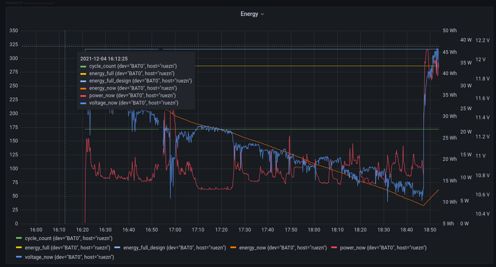

# telegraf-battery-input
Telegraf battery monitoring

Add the following config section to your telegraf.yml:

```
[[inputs.exec]]
  commands = ["/etc/telegraf/battery.sh"]
  data_format = "influx"
```


